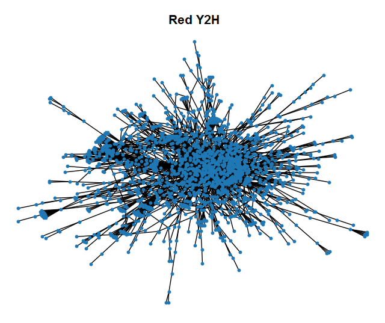
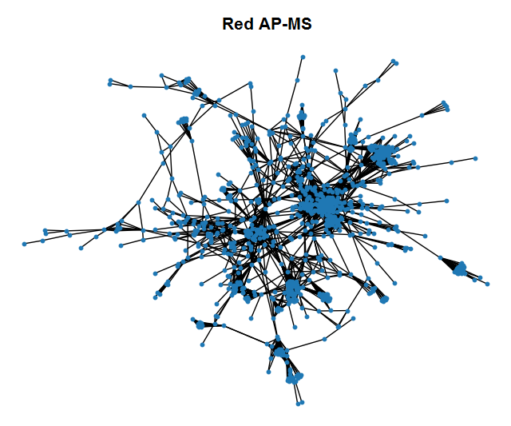
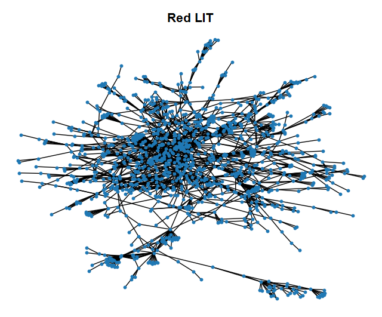

# Redes Complejas

En este trabajo se analizan distintas redes (redes de interacción proteína-proteína, redes sociales, redes de colaboraciones científicas) utilizando herramientas de Redes Complejas, área de investigación relativamente joven (años 2000) de la que fueron pioneros László Barabási y Mark Newman entre otros.

## Parte 1
En esta sección se estudian 3 redes de interacciones entre proteínas, las cuales están en la carpeta ``dataset``. Estas 3 redes corresponden al mismo organismo (levadura) pero fueron relevadas de distintas maneras:

* ``yeast_Y2H.txt``: red de interacciones binarias
* ``yeast_AP-MS.txt``: red de copertenencia a complejos proteicos
* ``yeast_LIT.txt``: red relevada de la literatura

En el script ``parte_1.py`` se desarrolla el siguiente análisis:
En primer lugar se grafica cada red representándola con un grafo, donde cada nodo es una proteína y cada vértice representa una interacción. Para mayor claridad sólo se graficó la componente conexa más grande, como se muestra a continuación:

En segundo lugar se calculan diversas propiedades de las redes, y se muestran los resultados en la siguiente tabla:

| FILE     | N        | L        | k_medio  | k_max    | k_min    | densidad | C_global | C_local  | diametro |
| ---------|----------|----------|----------|----------|----------|----------|----------|----------|--------- |
| Y2H      | 2018     | 2930     | 2.9      | 91       | 1        | 0.001    | 0.02     | 0.05     | 14       |
| LIT      | 1536     | 2925     | 3.8      | 40       | 1        | 0.002    | 0.35     | 0.29     | 19       |
| AP-MS    | 1622     | 9070     | 11.2     | 127      | 1        | 0.007    | 0.62     | 0.55     | 15       |
